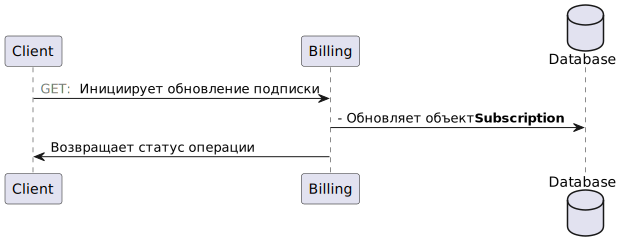

## Общая архитектура сервиса
\#TODO

## Сущности в БД

## Описание взаимодействий с сервисом
### Клиент
#### Оплата подписки

#### Возврат средств
\#TODO

#### Отмена подписки
\#TODO

### Менеджер
#### Подключение подписки менеджером

#### Отключение подписки менеджером
\#TODO

#### Заморозка подписки менеджером
\#TODO
